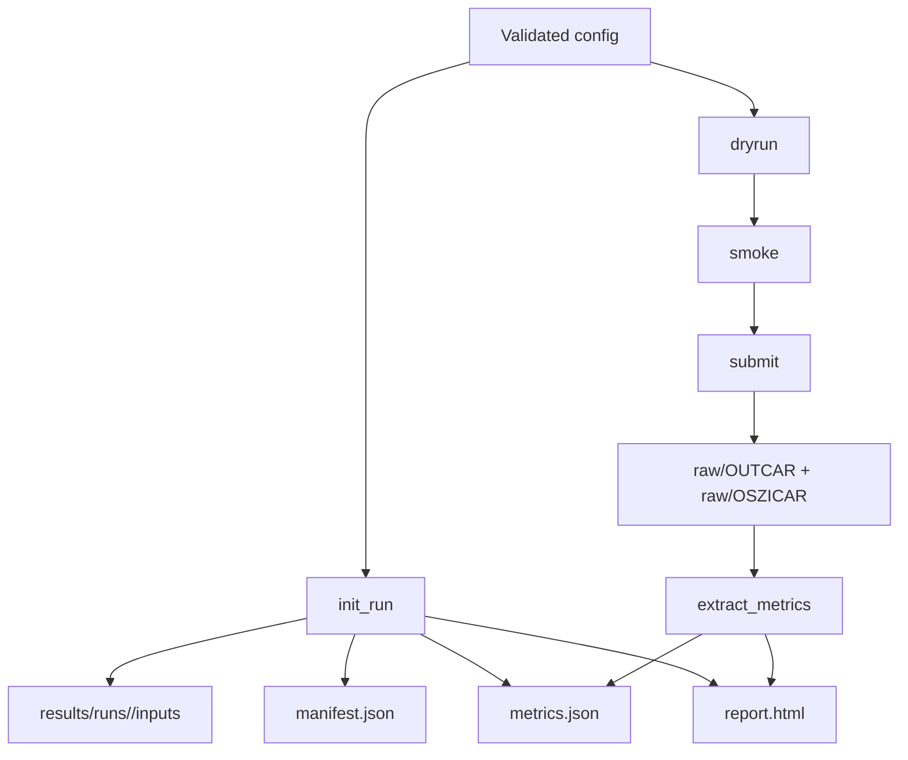

# Computational Workflow

This page explains the algorithms that move a configuration file to an auditable run directory, and then move raw VASP outputs to parsed metrics and a human-readable report.

## Workflow Overview

The workflow is intentionally split into small, inspectable steps:

1. validate the config,
2. initialize the run directory,
3. check the HPC path in `dryrun`,
4. check execution health in `smoke`,
5. submit only after the gate passes,
6. parse outputs into metrics,
7. regenerate the HTML report.

## Config Validation

The current top-level config model is defined in `src/hydrogen_solubility/config_models.py`.

The stage-1 baseline validates:

- `run.run_id` format and consistency with the encoded system/stage/method,
- host structure metadata,
- VASP control values,
- convergence-scan values,
- Slurm scheduler metadata,
- provenance labels such as POTCAR identifiers.

This is a deliberate design choice. It keeps the workflow config-driven and makes invalid scientific assumptions fail before compute time is consumed.

## Run Bootstrap Algorithm

`tools/init_run.py` calls `hydrogen_solubility.run_bootstrap.init_run_from_config`.

The bootstrap algorithm performs the following operations:

1. load and validate the config,
2. infer the repository root and results root,
3. create `results/runs/<run_id>/`,
4. create the canonical subdirectories:
   - `inputs/`
   - `logs/`
   - `raw/`
   - `parsed/`
5. copy the config snapshot into `inputs/`,
6. write `manifest.json`,
7. write the starter `metrics.json`,
8. write the starter `report.html`.

That is the reason the repository can treat every run as a self-contained evidence package.

## Parser Algorithm

`tools/extract_metrics.py` delegates to `hydrogen_solubility.vasp_metrics.build_stage1_metrics_payload`.

The parser is deliberately simple and transparent:

- `OUTCAR` is scanned with regular expressions for `TOTEN`, `NIONS`, `NSW`, and convergence strings.
- `OSZICAR` is used as a fallback source for the final energy values.
- the final `TOTEN` match is treated as the best energy when present,
- the final `OSZICAR` energy is used when `OUTCAR` does not expose a total energy,
- convergence flags are inferred from explicit text markers rather than hidden heuristics.

The status logic is:

- `success` when electronic convergence is present and the ionic state is either converged or not applicable,
- `partial` when an energy is available but not all convergence checks are confirmed,
- `failed` when no usable energy can be recovered.

That status logic is encoded in the parser so the report and metrics stay aligned.

## Report Generation

The HTML report is generated by `src/hydrogen_solubility/reporting.py`.

The report intentionally surfaces the same information that a human reviewer needs first:

- run identity,
- stage and system,
- objective,
- status,
- energies,
- convergence checks,
- artifact paths,
- execution events.

This keeps the fast QA path close to the machine-readable provenance.

## HPC Orchestration Contract

The repository’s Slurm workflow follows the required order:

1. `dryrun`
2. `smoke`
3. `submit`

The shell wrappers in `tools/hpc/` are the canonical entry points for those modes. They exist so cluster specifics remain in config files and scheduler templates, not in ad hoc scripts.

## Implementation Surface

The key modules in `src/hydrogen_solubility/` are small by design:

- `config_models.py` validates the stage-1 config contract,
- `run_bootstrap.py` builds the run directory and starter artifacts,
- `vasp_metrics.py` parses VASP text outputs,
- `reporting.py` renders the deterministic HTML summary,
- `pipeline.py` ties the pieces together for the CLI scripts.

For code-level API details, see [`api_reference.md`](api_reference.md).
