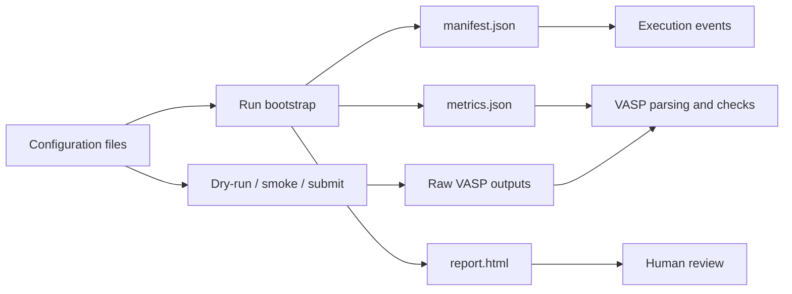

# Hydrogen Solubility Documentation

This site is the canonical, reader-friendly interface for the project. It ties the code, the science, the workflow contract, and the manuscript plan into one documented system.

The project asks a mechanistic question: why does hydrogen remain much more soluble in yttrium than in zirconium under comparable conditions? The answer will come from a reproducible chain that spans validated DFT energetics, vibrational corrections, thermodynamic mapping, and phase competition analysis.

```{note}
This documentation is intentionally written to be useful both as project memory and as manuscript scaffolding. If a code or workflow change alters the interpretation of the science, the docs must change with it.
```

| Area | What it covers |
| --- | --- |
| Scientific foundation | The thermodynamics, site-occupancy equations, vibrational free energies, and phase-competition logic behind the Y-vs-Zr contrast. |
| DFT introduction | The electronic-structure theory, Kohn-Sham equations, plane waves, cutoff, and k-point basics behind the calculations. |
| Computational workflow | How configs, run bootstrap, dry-run-first HPC orchestration, parsing, and reporting work together. |
| Beginner workflow | The practical input/output/run-analysis path for newcomers. |
| Provenance contract | The run-directory layout, JSON artifacts, execution events, and update rules that keep results auditable. |
| Manuscript blueprint | The claim tree, evidence map, and figure/table plan for turning results into a scientific paper. |
| API reference | Autodoc coverage for the package modules that implement validation, parsing, reporting, and run bootstrap. |
| Literature map | The curated bibliography and benchmark records that anchor the scientific claims. |
| Mission and contract | Project scope, assumptions, and the collaboration contract for reproducible work. |
| Stage plan | Stage gates from host validation to manuscript package completion. |

```{toctree}
:maxdepth: 2
:hidden:

scientific_foundation
dft_introduction
beginner_workflow
computational_workflow
provenance_and_contract
manuscript_blueprint
api_reference
literature_map
mission
collaboration_contract
README
config_schema
conventions
data_model
getting_started
roadmap
stage1_campaign
vasp_primer
vasp_simulation_guide
```

## Documentation Flow



## Start Here

1. Read [`docs/mission.md`](mission.md) for the scientific target.
2. Read [`docs/collaboration_contract.md`](collaboration_contract.md) for the collaboration contract.
3. Read [`docs/scientific_foundation.md`](scientific_foundation.md) for the equations and assumptions.
4. Read [`docs/dft_introduction.md`](dft_introduction.md) for the DFT theory and math.
5. Read [`docs/beginner_workflow.md`](beginner_workflow.md) for the practical run workflow.
6. Read [`docs/computational_workflow.md`](computational_workflow.md) for the code-path and algorithm map.
7. Read [`docs/provenance_and_contract.md`](provenance_and_contract.md) for the evidence trail and file contracts.
8. Read [`docs/manuscript_blueprint.md`](manuscript_blueprint.md) for the manuscript structure.

## Build The Docs

Install the docs dependencies and build the site:

```bash
pip install -r requirements-docs.txt
python -m sphinx -W -b html docs docs/_build/html
```

For link validation:

```bash
python -m sphinx -W -b linkcheck docs docs/_build/linkcheck
```
